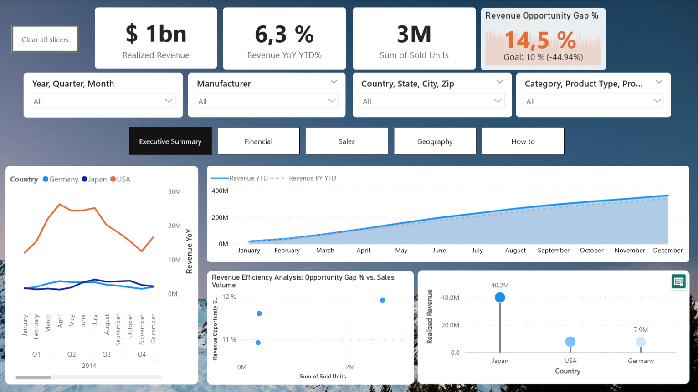
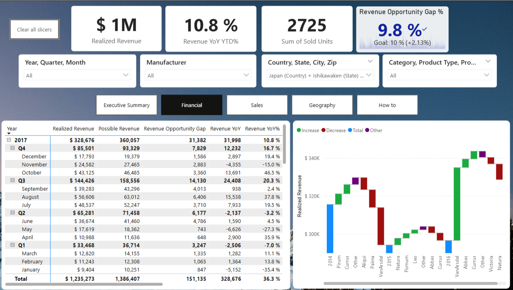
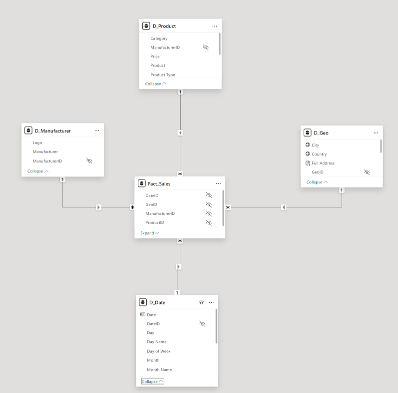
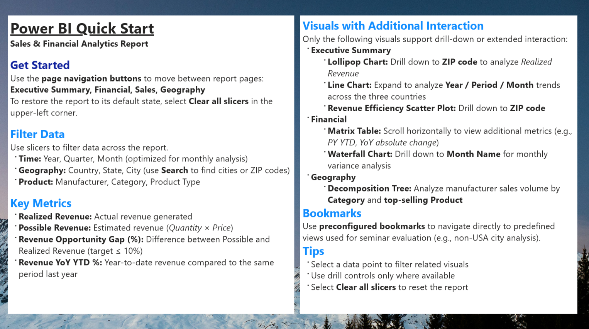

# Global Retail BI Application

**Power BI Sales and Financial Analytics Project**

This project presents an interactive Business Intelligence application developed to analyze retail sales across three international markets: **the United States, Germany and Japan**.

The report combines transactional data from the three countries and provides management views for revenue, sales volume, product performance, geographic analysis and year-over-year comparisons.



---

## Project Overview

The objective of the project was to build a Power BI report that could support monthly management reviews and help identify sales trends, revenue gaps and performance drivers.

The original data sources had different structures, languages and regional formats. The complete data preparation process was implemented in Power Query, without modifying the raw files externally.

Users can analyze performance from a general country-level view and drill down into manufacturers, product categories, cities and ZIP codes.

---

## Business Questions

The report was designed to answer questions such as:

- How much revenue is generated across the three markets?
- How is current revenue performing compared with the previous year?
- What is the difference between realized and possible revenue?
- Which periods and manufacturers explain revenue growth or decline?
- Which countries account for the largest share of unit sales?
- Which manufacturers, product types and categories perform best?
- How do revenue and unit sales change over time?
- Which cities and ZIP code areas have the strongest performance?
- What factors explain changes in total sales volume?

---

## Dashboard Pages

### Executive Summary

The executive view provides a general overview of realized revenue, units sold, year-over-year performance and the revenue opportunity gap.

It also allows users to compare the three countries and review cumulative revenue against the previous year.

### Financial Analysis

The financial page compares realized revenue, possible revenue and revenue opportunity gaps by year, quarter and month.

The waterfall chart helps identify which manufacturers contributed to revenue increases or decreases.



### Sales Analysis

The sales page compares performance by country, manufacturer, product type and category.

It also shows the relationship between revenue and sales volume over time.


### Geographic Analysis

The geographic page allows users to explore sales by location and identify geographic concentrations of sales volume.

The decomposition tree provides additional analysis by manufacturer, category and product.


---

## Example Findings

Some findings obtained from the report include:

- Kanazawashi was the highest-revenue city outside the United States in 2017.
- The city generated approximately **$5.2 million** in realized revenue.
- Revenue in Kanazawashi increased by approximately **2.36%** compared with 2016.
- ZIP code **920-0952** was the highest-performing area within the city.
- Currus and Pirum were the main positive contributors to revenue growth.
- Urban, Rural and Youth were the leading product categories in Kanazawashi.

---

## Data Preparation

The ETL process was developed entirely in Power Query.

The main preparation steps included:

- Importing transactional data from the United States, Germany and Japan.
- Standardizing column names across the three datasets.
- Correcting regional date and number formats.
- Cleaning city names and ZIP codes.
- Combining the country-level sales tables.
- Creating dimension tables for date, product, manufacturer and geography.
- Connecting transactional records with the corresponding dimension keys.

A central query called `MasterSource` was used as the source for the dimension tables, reducing repeated access to the original master data file.

---

## Data Model

The model follows a star-schema structure with `Fact_Sales` as the central fact table.

The fact table is connected to four dimensions:

- `D_Date`
- `D_Product`
- `D_Manufacturer`
- `D_Geo`



The model also includes the following hierarchies:

- **Time:** Year → Quarter → Month
- **Product:** Category → Product Type → Product
- **Geography:** Country → State → City → ZIP

---

## Analytical Measures

The main DAX measures developed for the report include:

- **Realized Revenue:** Actual revenue generated from sales.
- **Possible Revenue:** Estimated revenue calculated as sold units multiplied by product price.
- **Revenue Opportunity Gap:** Difference between possible and realized revenue.
- **Revenue Opportunity Gap %:** Percentage of potential revenue not realized.
- **Revenue YTD:** Cumulative revenue from the beginning of the year.
- **Revenue Previous Year:** Revenue generated during the previous year.
- **Revenue YoY %:** Percentage change compared with the previous year.
- **Revenue YoY YTD %:** Year-to-date change compared with the same period of the previous year.

A 10% threshold was used to highlight revenue opportunity gaps requiring further analysis.

---

## Main Features

- Data cleaning and transformation using Power Query.
- Consolidation of sales data from three international markets.
- Dimensional modeling using a star schema.
- Time-intelligence calculations using DAX.
- Drill-down by time, geography and product.
- Revenue and sales comparisons against previous-year performance.
- Geographic analysis using ArcGIS maps.
- Root-cause exploration using a decomposition tree.
- Interactive slicers, navigation buttons and bookmarks.

---

## How to Use the Report

- Use the navigation buttons to move between report pages.
- Filter the report by time, manufacturer, geography or product.
- Use drill-down controls to explore months, cities and ZIP codes where available.
- Select a visual element to filter the related charts.
- Select **Clear all slicers** to return to the default report view.

<details>
<summary>View the complete report instructions</summary>



</details>

---

## Tools Used

- Power BI Desktop
- Power Query
- DAX
- Dimensional Modeling
- ArcGIS Maps for Power BI
- Decomposition Tree
- Git and GitHub

---

## Repository Structure

```text
├── docs/                    # Technical documentation
├── images/                  # Dashboard screenshots
│   ├── executive_summary.png
│   ├── financial.png
│   ├── sales.png
│   ├── geography.png
│   ├── star_schema.png
│   └── how_to.png
├── src/                     # Power BI Project files
├── .gitignore               # Excludes raw and temporary files
└── README.md                # Project overview